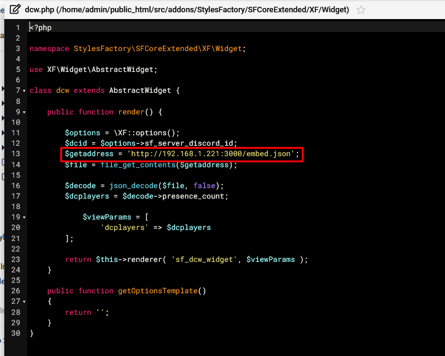

# sfcore_embedcache
A small Express app that caches the embed.json file from discordapp.com to prevent SFCore Extended from reaching a Discord API ratelimit

I created this small app to avoid getting the ratelimits from discordapp.com, as SFCore Extended was sending a request to Discord every time a user visits a page.

## Installation

Simply put this project somewhere it can run 24/7, it does not require a lot of resources, I run it with 256MB of RAM and 1GiB of storage.

After that, you'll need to edit the public_html/src/addons/StylesFactory/SFCoreExtended/XF/Widget/dcw.php file to use the new URL,

Simply replace $getaddress from the usual discordapp.com to the URL of the Express app you just started.
